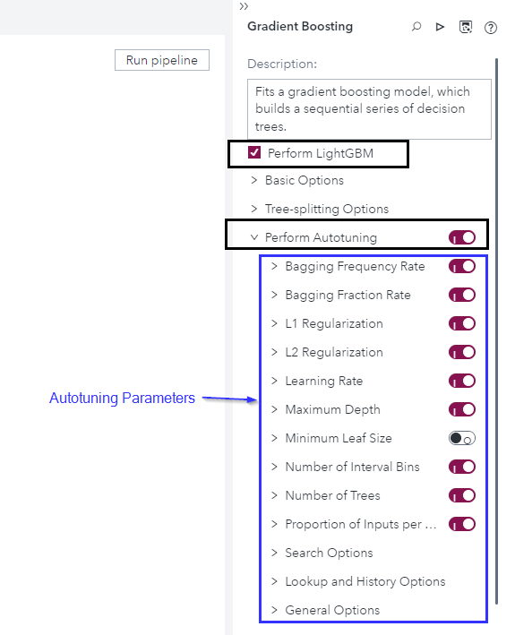

# Autotuning for LightGBM in SAS Model Studio

1. Go to SAS Model Studio
2. Click *New project*
3. Give the project a name, e.g. *HMEQ LightGBM Autotune*

4. As the type select *Data Mining and Machine Learning*

5. As the template select *Blank template*

6. For data select the HMEQ dataset that can be created with the [Load HMEQ Utility script](../utility/loadHMEQ.sas)

7. Click *Save*

8. In the *Data* tab select the variable *BAD* and change its role to *Target*

9. Go to the pipelines tab, right click the *Data* node and select *Add child node > Supervised Learning > Gradient Boosting*

10. Check the *Perform LightGBM* box and toggle *Perform Autotuning*

11. If you want to can adjust the Autotuning parameters for more information check the [SAS documentation](https://go.documentation.sas.com/doc/en/capcdc/default/vdmmlcdc/vdmmlref/p15lrmgnt7b0qrn1paqu1ddfw7mo.htm#n0k7nnqr9exnafn113x47296en3m)

12. Click *Run pipeline*, wait for the pipeline to finish and take  a look at the results