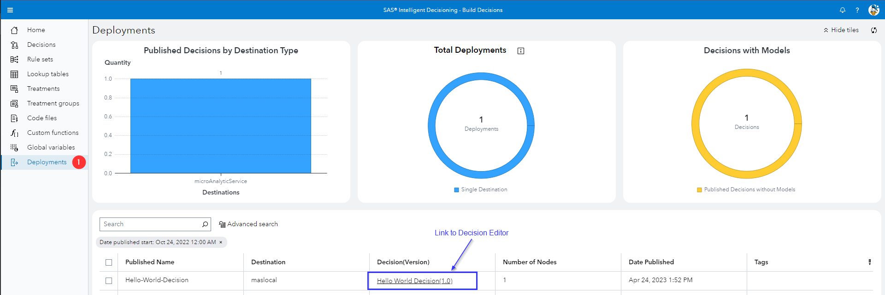

# View Published Decisions in SAS Intelligent Decisioning

1. Import the Decision Example included [here](./Decision-Example.json) using **SAS Environment Manager**
2. This will import a folder into the *Public* folder, called *Decision-Example* - which contains a Rule Set (*Hello World*) and a Decision (*Hello World Decision*)
3. Navigate to **SAS Intelligent Decisioning** (called *Build Decision* in the main menu), open the Decision *Hello World Decision* and click the *Publish* button
4. Select a *Destination* (e.g. SAS Micro Analytic Service (maslocal))
5. Give the decision a *Published name* (e.g. *Hello-World-Decision*) and click the *Publish* button
6. Click on the *Destination* pane menu item and take a look at the *Deployments Overview*:

