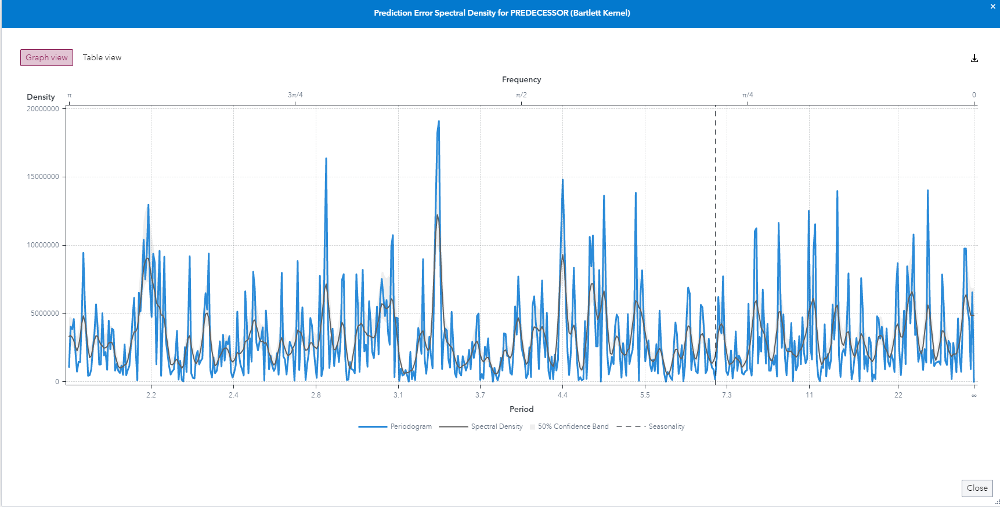
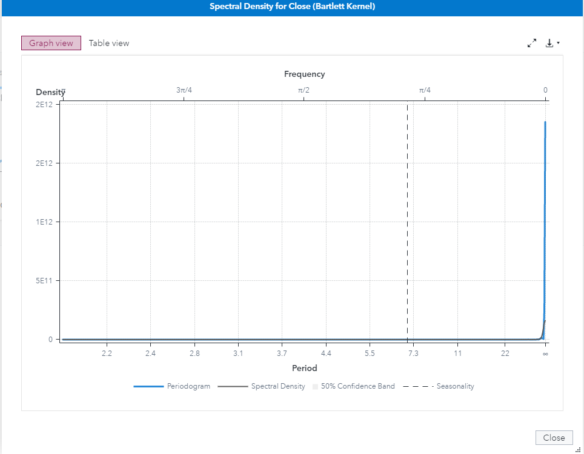

# Spectral Density Plots

1. Go to SAS Model Studio

2. Click *New project*

3. Give the project a name, e.g. *BTC Spectral Forecasting*

4. As the type select *Forecasting*

5. As the template select *Auto-forecasting*

6. For data select the BTC dataset that can be created with the [BTC utility script](../utility/getBitcoinPrice.sas)

7. Click *Save*

8. Go to *Pipelines* and let the *Pipeline 1* run

9. Once the pipeline is finished running right click the *Model Comparison* node

10. Hover on *Add parent node*, go to *Postprocessing* and select *Interactive Modeling*

11. Right click the *Interactive Modeling* node and click *Run*

12. Once it has finished running click *Open*

13. In the *Modeling* tab under *View diagnostic plot/table* select *Basic error analysis > Prediction error spectral density*

    

14. In the *Series Analysis* tab click the *Plus* icon and select *Basic analysis > Spectral density*

