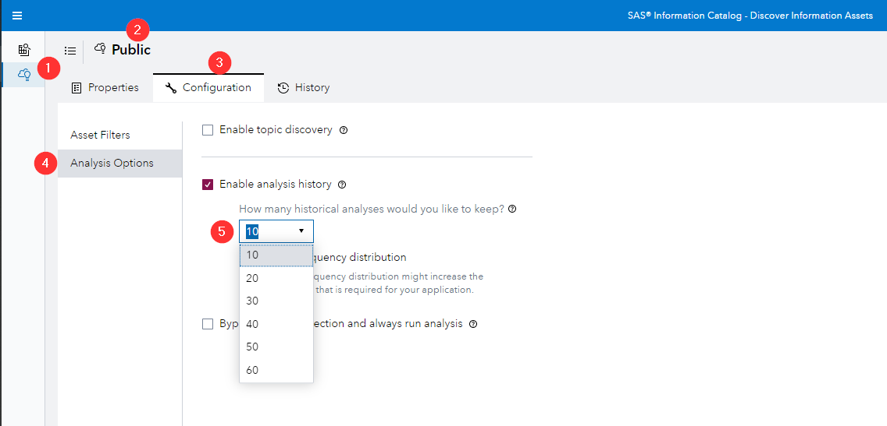
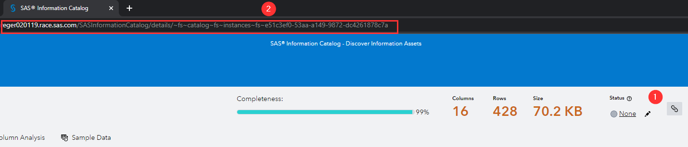
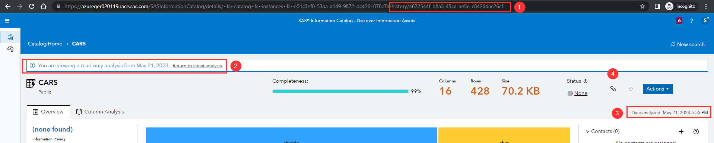

# Deep Linking into the SAS Information Catalog Analysis history

**Note:** If you copy the link from the most current analysis that link isn't version specific but will rather always link to the most current iteration.

**Note:** That the analysis history is being deleted overtime, the default is after 10 analysis, the length of the history can be set at the agent level (Discovery Agents > Specific Agent > Configuration > Analysis Options > Change from 10 to the desired value) - the current maximum value is 60.

## Getting the Deep Links

1. Search for the table that you are interested in and open it

2. Now you see the Overview page of your table, you were already able to copy the link by clicking the link icon or by using the browser bar to copy the deep link (this link adjust if you drill into individual columns as well):

   

3. Now click on the Action button > hover over Analysis history (x) and select one of the version (the small check mark indicates which version you are currently viewing)

4. If you look at the URL you can see that it changed to have /history/id added, you will also see a little notification that notifies you that you are viewing an out of date analysis history and of course the Date analyzed highlights the corresponding timestamp

5. As before you can now use the link icon or the URL to copy the deep link to this asset

   