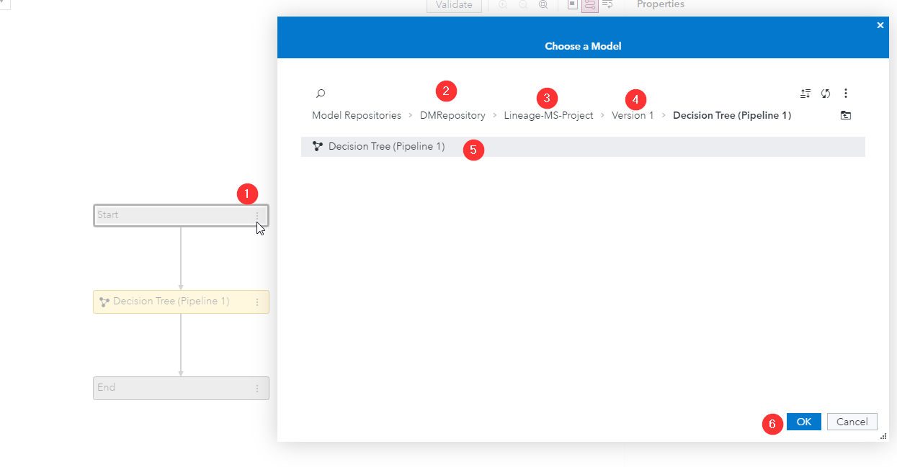
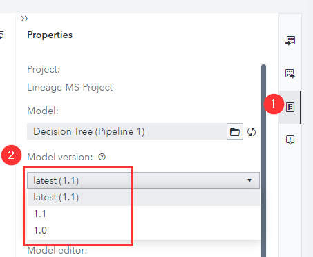

# Specify Model Versions in Decisions

1. Create a model and register it to SAS Model Manager

2. Create a new decision in SAS Intelligent Decisioning

3. Click on the three vertical dots on the Start node > Add below > Model

4. Navigate to the Model Repository > Model Studio Project > Version > Model and click OK

   

5. Now click on the model node, go the Properties pane and take a look at the Model version

   

6. If you select latest (x.x) then as the model is updated the model version used in the decision is updated along side it, but if you prefer to use a static model version just select one of the x.x below that option and the model version will not automatically update along with the model