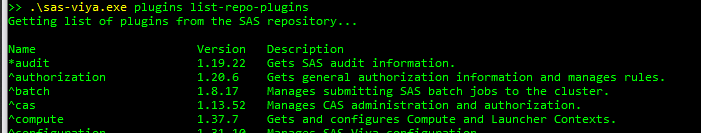

# SAS Viya CLI New Command Job Flows show-history-tree

**Note:** I will be showcasing all commands using the Windows PowerShell if you are in a bash shell will look a bit different, but mostly the same.

1. Download the SAS Viya CLI from [https://support.sas.com/downloads/package.htm?pid=2512](https://support.sas.com/downloads/package.htm?pid=2512) - if already installed you can skip this step
2. Navigate to the directory where you have unzipped the sas-viya.exe
3. Get a list of all plugins and make sure that at least the job plugin is up to date/installed (meaning it has a star in front of it - i.e. audit) a ^ means that an update is available
   

```bash
.\sas-viya.exe plugins list-repo-plugins
```

4. To install/update a plugin just run the following command replacing the name with the plugin name

```bash
.\sas-viya.exe plugins install -repo SAS name
# Or run this command to just update/install everyting
.\sas-viya.exe plugins install -repo SAS all
```

5. Create a profile to authenticate with your SAS Viya environment - see this [SAS documentation](https://go.documentation.sas.com/doc/en/sasadmincdc/v_040/calcli/n1e2dehluji7jon1gk69yggc6i28.htm?fromDefault=#p17rei99cguhqdn13m8vgg81nlax)
5. Now for the rest please refer this [SAS documentation example](https://go.documentation.sas.com/doc/en/sasadmincdc/v_040/caljobs/p10eiyydjxtlm9n1mu07aqzjm9g0.htm#n1624lf3doskmen1jf27dgk1br1o)