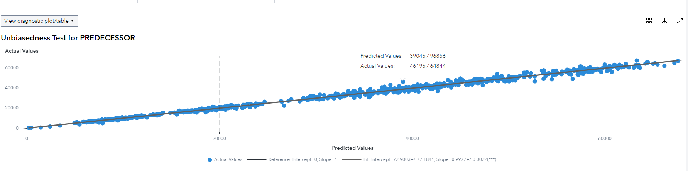

# Unbiasedness Test

1. Go to SAS Model Studio

2. Click _New project_

3. Give the project a name, e.g. _BTC Unbiasedness Test_

4. As the type select _Forecasting_

5. As the template select _Auto-forecasting_

6. For data select the BTC dataset that can be created with the [BTC utility script](../utility/getBitcoinPrice.sas)

7. Click _Save_

8. Go to _Pipelines_ and let the _Pipeline 1_ run

9. Once the pipeline is finished running right click the _Model Comparison_ node

10. Hover on _Add parent node_, go to _Postprocessing_ and select _Interactive Modeling_

11. Right click the _Interactive Modeling_ node and click _Run_

12. Once it has finished running click _Open_

13. In the _Modeling_ tab under _View diagnostic plot/table_ select _Model fit > Unbiasedness test_

14. Here you can view the resulting Unbiasedness Test as both a plot and a table:

