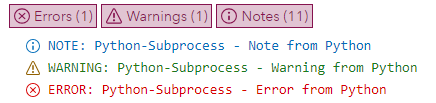

# Proc Python logMessage method

The SAS object inside of a Python sub process has received a new method *logMessage*. This method enables you to send nicely formatted message back to the SAS log.

The method has one required input which is the actual message you want to send back from Python:

```python
SAS.logMessage('Note from Python.')
```

This will generate the following entry in the SAS log:

```SAS
NOTE: Python-Subprocess - Note from Python
```

As a positional argument you can add the *messageType* to specify if you want an error or a warning printed to the SAS log instead of the note (which is the default).

```python
SAS.logMessage('Warning from Python', messageType='warning')
SAS.logMessage('Error from Python', messageType='error')
```

Will produce the following the in the SAS log:

```SAS
WARNING: Python-Subprocess - Warning from Python
ERROR: Python-Subprocess - Error from Python
```

So what is this feature for? Well mainly to handle errors in the Python sub process with more grace and generate more helpful error messages to users. This can come in handy when building custom steps and requiring certain packages - here is an example snippet:

```python
try:
	import xarray as xr
except ImportError:
	SAS.logMessage('This step needs the Python package xarray to run', messageType='ERROR')
	sys.exit(1)
```

And here you can see what you would see if you run all of the three lines one after the other:

