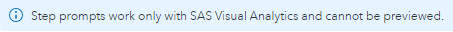
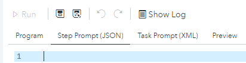
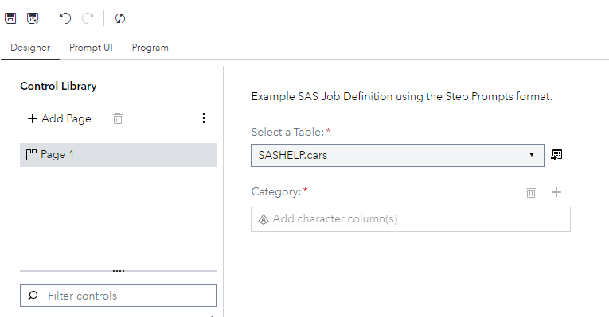
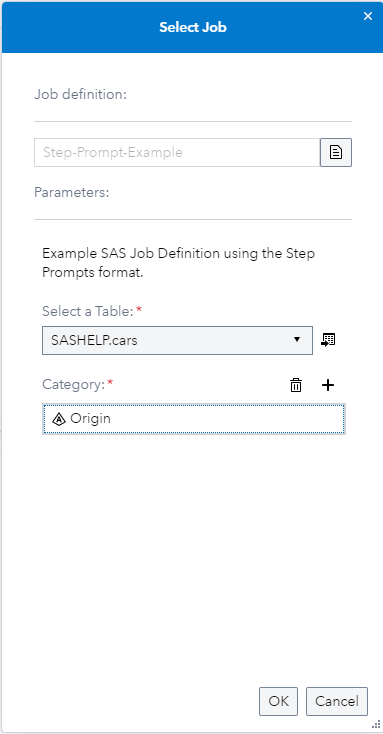
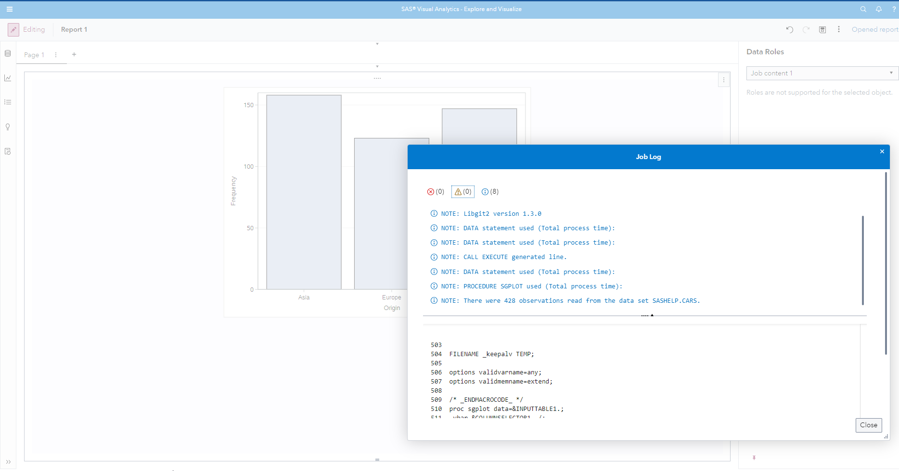

# Studio Step Based Job Definitions

The release of SAS Viya 2023.06 introduces the ability to generate JSON based prompts for SAS Job Definitions.

This enables you to use the Custom Step Designer to visually build your interface and then take the build JSON and copy & paste it as the Step Prompt for the Job Definition. The limitation of this approach is, that you can currently only use this interface when you use the **Job content** object. But this ability will be added to SAS Studio in a future release. This is the message you will see in SAS Studio:



## Getting started with it

In SAS Studio click on the *New* menu entry, hover over *Job* and click on *Definition*. Then on the right hand side click on the *Associate a Form* icon and select *Task prompt* from the radio buttons. This will add the little information banner pictured above. Now you should see the following:



Please ensure that you are in the *Step Prompt (JSON)* tab. Now we are going to start build our UI. For this step we will go to the *New* menu entry and click on *Custom Step*. Now that we are in the designer you can build your interface by dragging and dropping *Common* and *Data* elements into the canvas. For this example we will be dragging a *Text*, *Input Table* and *Column Selector* onto the canvas (below you will also find the full example JSON if you do not want follow this step by step). We will not be changing the IDs of the elements, thus ensuring that the code will run correctly. For the text element I entered the following text: "Example SAS Job Definition using the Step Prompts format.". For the *Input Table* I changed the label to read "Select a Table:", set the default library to "SASHELP" and the default table to "cars".  For the *Column Selector* I changed the label to read "Category:", set the link to input table to reference our *Input Table*, filtered the column type to be character only, set the minimum and maximum columns to 1. The final UI in the Designer should look like this:



Now switch to the *Prompt UI* tab and copy the JSON from the - it should look like this:

```json
{
	"showPageContentOnly": true,
	"pages": [
		{
			"id": "page1",
			"type": "page",
			"label": "Page 1",
			"children": [
				{
					"id": "text1",
					"type": "text",
					"text": "Example SAS Job Definition using the Step Prompts format.",
					"visible": ""
				},
				{
					"id": "inputtable1",
					"type": "inputtable",
					"label": "Select a Table:",
					"required": true,
					"placeholder": "",
					"visible": ""
				},
				{
					"id": "columnselector1",
					"type": "columnselector",
					"label": "Category:",
					"order": true,
					"columntype": "c",
					"max": 1,
					"min": 1,
					"visible": "",
					"table": "inputtable1"
				}
			]
		}
	],
	"values": {
		"inputtable1": {
			"library": "sashelp",
			"table": "cars"
		},
		"columnselector1": []
	}
}
```

Now we paste this JSON into our Job Definition and for the SAS program we will simply generating a little bar chart with ODS:

```SAS
proc sgplot data=&INPUTTABLE1.;
	vbar &COLUMNSELECTOR1. /;
	yaxis grid;
run;
```

Save the whole Job Definition - I am saving it SAS Content > Public > Viya-Verse > 202306 as Step-Prompt-Example but feel free to save it where it fits your strategy best. I have thrown away the Custom Step that we started to create, but feel free to save that as well if you are interested in it.

Now let's make use of this new SAS Job Definition by going to SAS Visual Analytics. Create a new report, go to the Objects pane and search for "Job content" drag the element onto the page. Click the select job button, under Job definition navigate to the Step-Prompt-Example and fill the Parameters:



Click the OK button to run the Job Definition and take a look at out ODS bar chart, by clicking on the three vertical dots (object menu) you can also view the job log:


You can also find the full Job Definition as an example to import [here](https://github.com/Criptic/SAS-Whats-New/tree/main/202306/Step-Prompt-Example.json).
