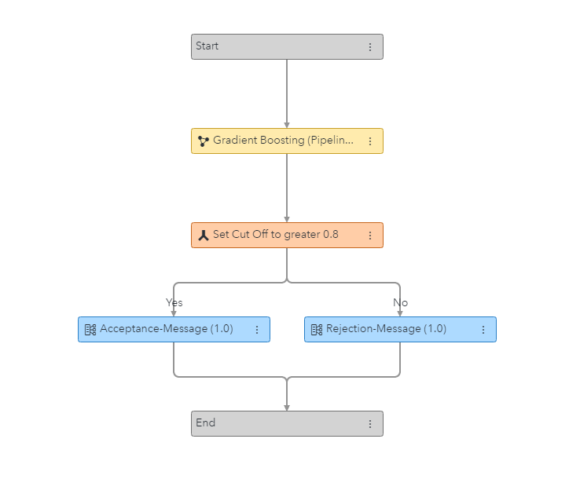
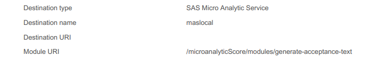

# Deployment Report

1. Create your decision - adding Rule Sets, Models, Treatments, etc. as needed

2. Here is the decision that I will be using for this example:

   

3. Now publish your decision here - for the example I will publish to both MAS and CAS

4. Go to the _Deployments_ page inside of SAS Intelligent Decisioning

5. Select the deployed decision, note that you will have one entry per publishing destination

6. Click on the _Generate report_ button, a PDF will be downloaded automatically

7. You can view the full CAS report [here](https://github.com/Criptic/SAS-Whats-New/tree/main/202307/Intelligent-Decisioning-Deployment-Report.pdf) and here is the one difference from the MAS report which is found on the _Properties_ page:

   
