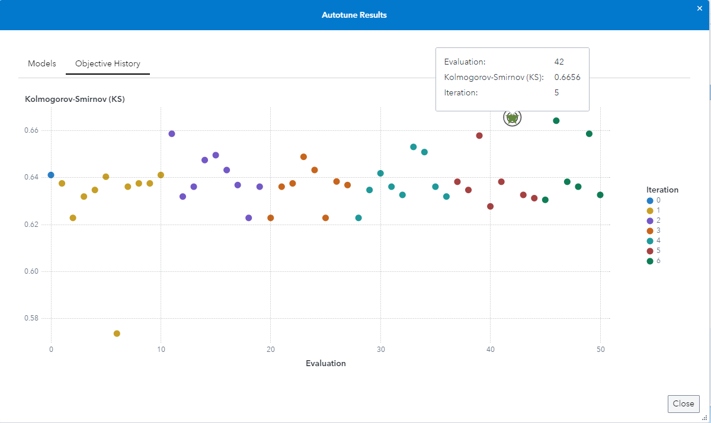

# Autotuning Results in SAS Visual Analytics

1. Head to SAS Studio and run the following code snippet to load the HMEQ dataset to the public library:

   ```SAS
   cas mysess;
   libname public cas caslib='public';
   
   data public.hmeq(promote=yes);
   	set sampsio.hmeq;
   run;
   
   cas mysess terminate;
   ```

   

2. Switch to SAS Visual Analytics > click New Report > Add data > search for hmeq and click Add

3. Switch the BAD variable from a Measure to a Category

4. Go to the Objects pane and search for Decision Tree, pull the object into the report page (the feature is available for all objects in the Statistics and Machine Learning category that support Autotuning)

5. Click Assign data, as the Reponse add the BAD variable and as Predictors use Select all + Apply

6. Go the Options pane of the Decision Tree object, click the Autotune button, change the Objective metric to Kolgomorov-Smirnov (KS) and click OK

7. Once the Decision Tree is retrained right click the object and select View autotune results (middle of the context menu) - you can also use the object level snowman menu to get there - for more information see the [SAS Documentation](https://go.documentation.sas.com/doc/en/vacdc/default/vaobjdmml/n1ot6nwcbwp4jmn1r7vks7d8g3ri.htm#p1r3g2uhzzv9yin1fzovrl1svb3m)

8. You get the following results:

   

