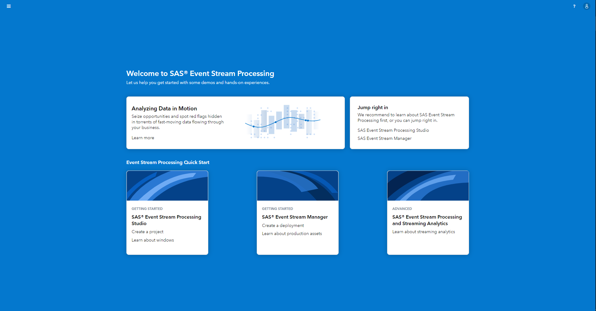
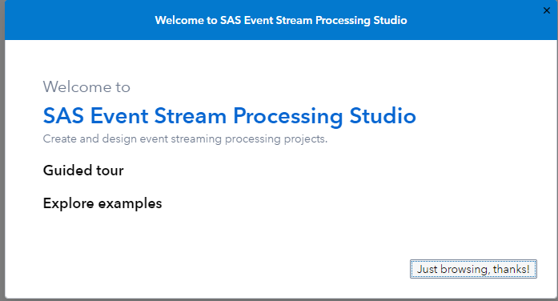

# SAS Event Stream Processing Studio Update

When you open up SAS Event Stream Processing (in the main menu under *Streaming Analytics > Design Streaming Projects*) you a greeted by this new Welcome Page:

If you move on to SAS Event Stream Processing Studio for the first time since this update you a created by a Guided Tour prompt, to make the interface easier to navigate, set you up with example or skip the tour to dive right in:

