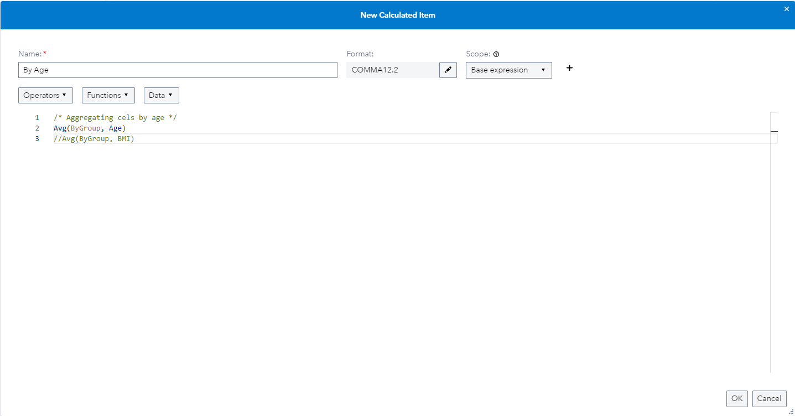
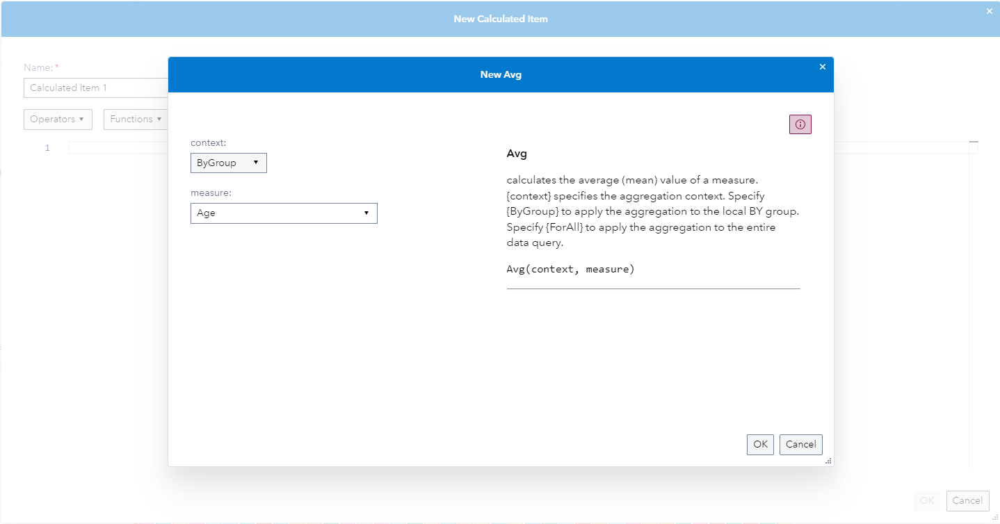
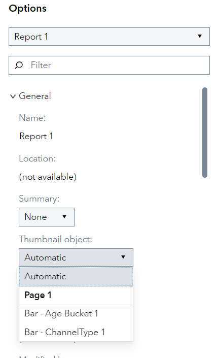
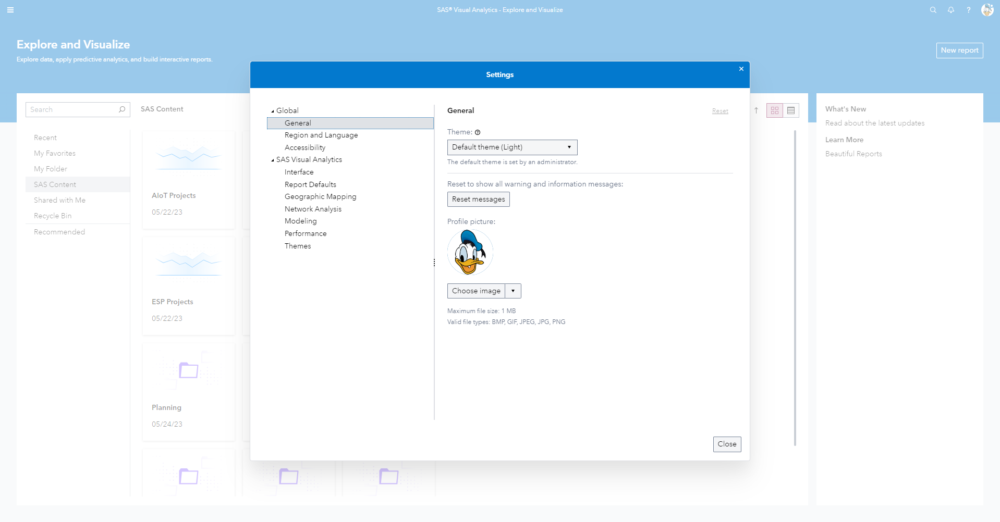
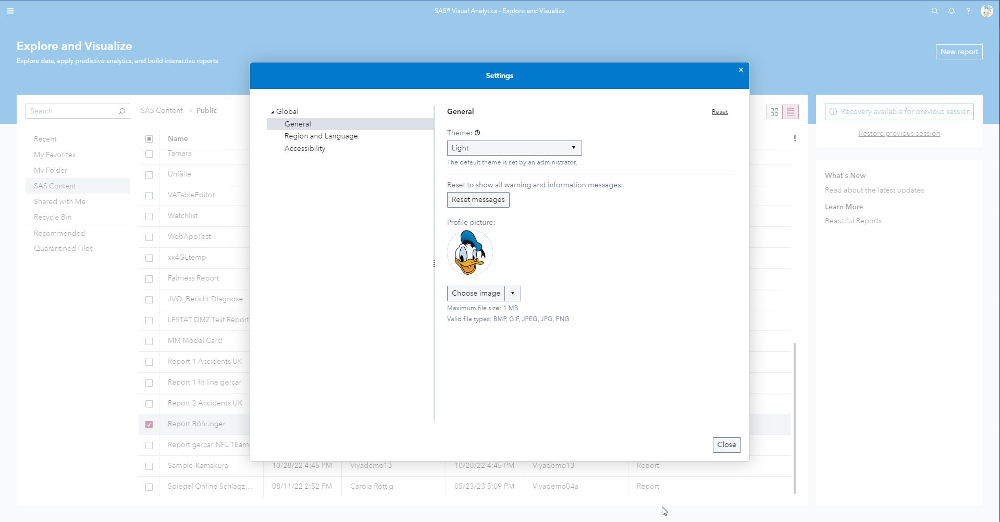

# Adding Comments to Calculated Items

You can now add Block (multiline) and Single line comments to the expression of a calculated item inside of SAS Visual Analytics. For multiline comments use the /* your comment goes here */ and fore single line comments use //.

# Pop-Up for Aggregated Calculations

Inside of the calculated items editor when you select one of the aggregation functions you now get a pop up to select all of the aggregation functionality, which then gets converted into code:

# Choosing the Thumbnail for your SAS Visual Analytics Report

When you go to the *Options* pane of a Report and select the Report itself (top most item). In the Section *General* you will find the ability to select any Graph created within your Report to be set as the Thumbnail that is displayed for example in SAS Drive or in the SAS Visual Analytics homepage.

# Changing the SAS Visual Analytics Settings from the Home page

You can access the SAS Visual Analytics Settings (Left click on your profile icon in the top right > Settings) to change the SAS Visual Analytics settings directly, without having to open up a report first:

The previous view looked like this:

