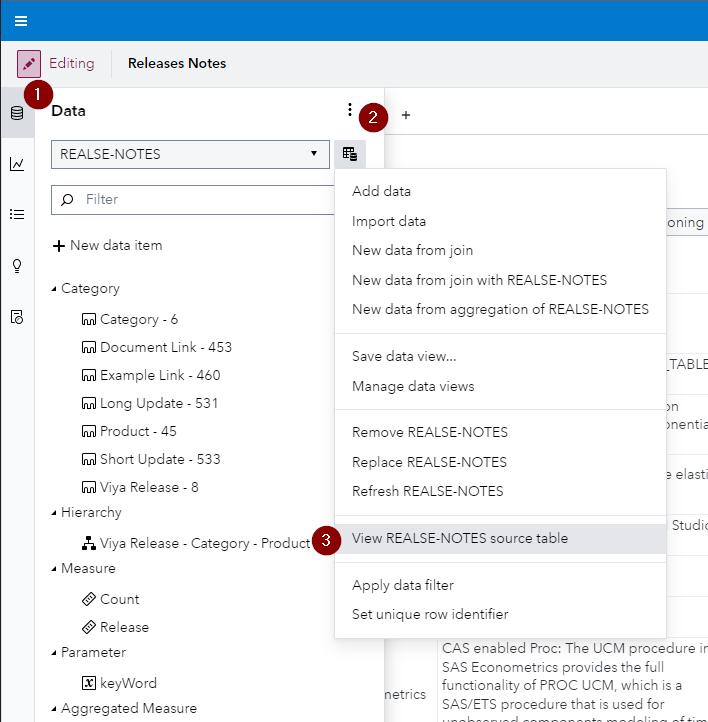
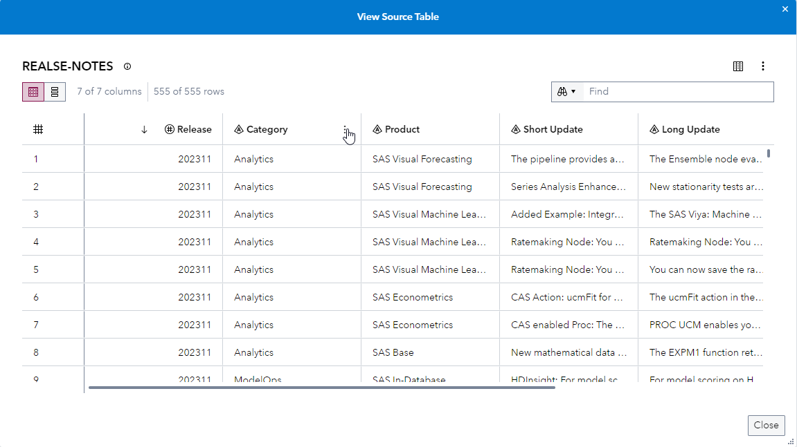
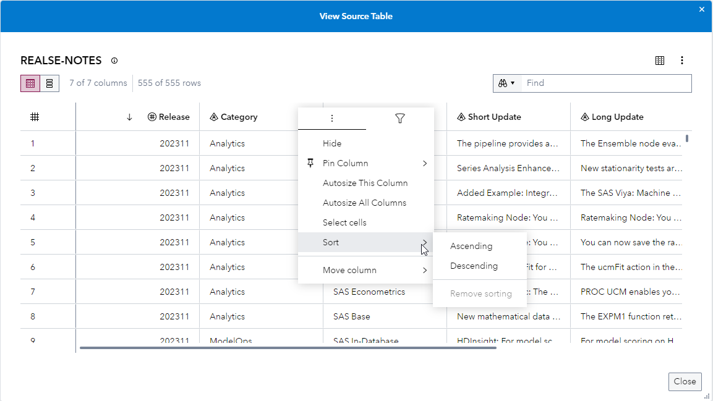

## View the Source Tables for Data Sources

The new View Source Table window enables authorized users to view the SAS Cloud Analytic Services (CAS) source tables for data sources. Access for this feature depends on the /SASVisualAnalytics_capabilities/sourceTableViewing application URI.

Ensure that you are in the Edit mode - You can access this by going to the *Data* pane of a SAS Visual Analytics report **(1)**. Click on the *Data source menu* icon **(2)** and click on *View TABLE NAME source table* **(3)**:

This opens up a pop up called View Source Table where you can easily scroll through the table, copy rows by selecting them, show/hide columns, export data, sort and filter columns:

