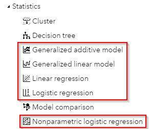
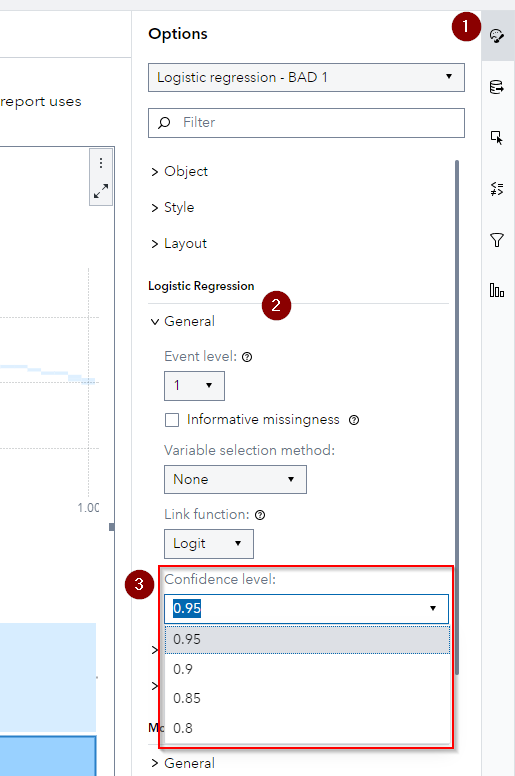

## Confidence Level Option

You can now change the Confidence Level for the following Statistical objects:

-   Generalized Additive Model
-   Generalized Linear Model
-   Linear Regression
-   Logistic Regression
-   Nonparametric Logistic Regression

Go to the Options Pane **(1)** of the object and scroll down to the General heading in the algorithm section **(2)**, here you can find the Confidence level Dropdown/Input field **(3)**:

