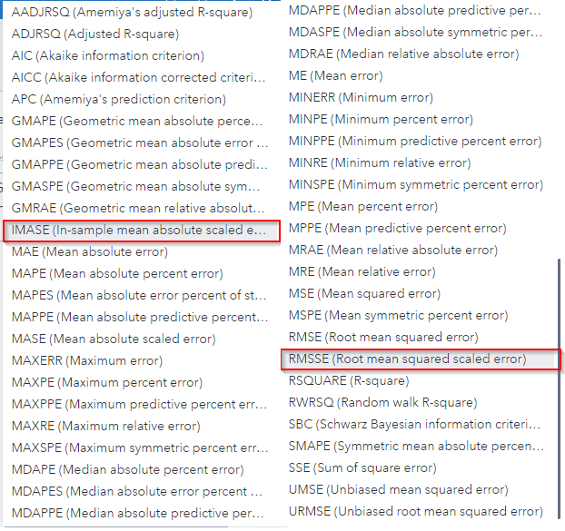

# New Fit Statistics: IMASE and RMSSE

1. Go to SAS Model Studio
2. Click _New project_
3. Give the project a name, e.g. _BTC Unbiasedness Test_
4. As the type select _Forecasting_
5. As the template select _Auto-forecasting_
6. For data select the BTC dataset that can be created with the [BTC utility script](../utility/getBitcoinPrice.sas)
7. Click _Save_
8. Go to _Pipelines_
9. Select the *Auto-forecasting* node
10. In the right hand side *Node options* under *Model Selection* you will find the *Model selection criterion*
11. If you click on the dropdown you are presented with all the different selection criterion, including IMASE and RMSSE
    
12. Of course this isn't limited to the *Auto-forecasting* node, but can also be used by other *Forecasting Model* nodes like *Hierarchical Forecasting* or *Seasonal Model*
