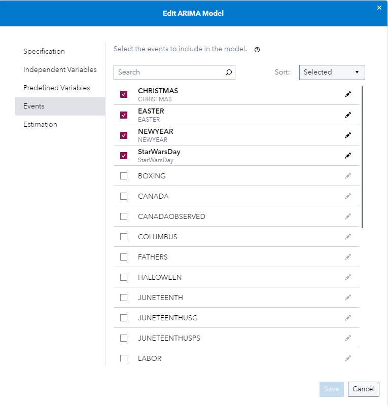
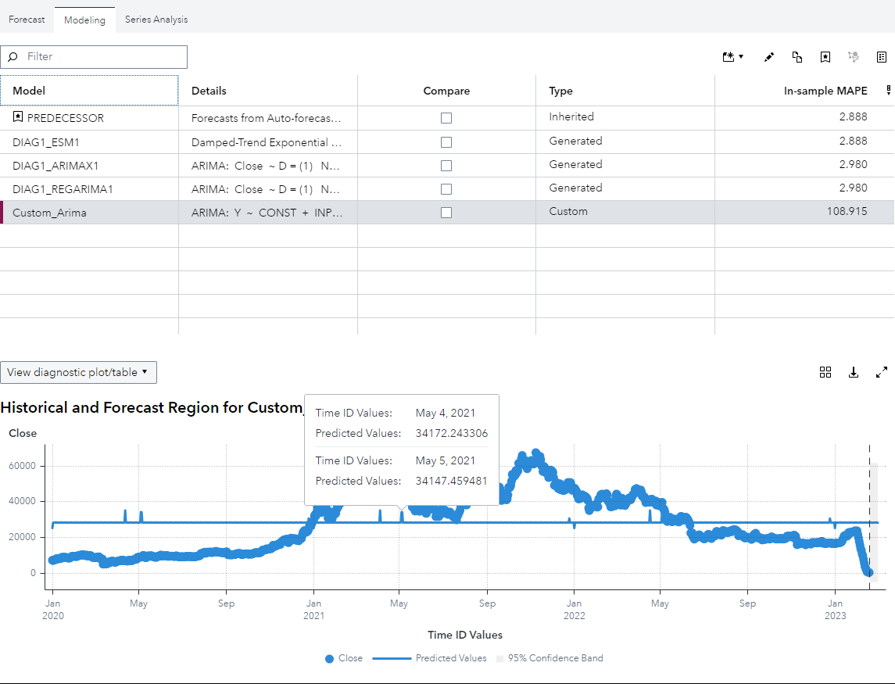

# Add Custom Events to Models

If you want to learn more please refer to the [SAS Documentation](https://go.documentation.sas.com/doc/en/capcdc/default/vfcdc/vfwn/n1sb76qfh4ci1fn1u6mi0n9r51tc.htm)

1. Go to SAS Model Studio

2. Click _New project_

3. Give the project a name, e.g. _BTC Unbiasedness Test_

4. As the type select _Forecasting_

5. As the template select _Auto-forecasting_

6. For data select the BTC dataset that can be created with the [BTC utility script](../utility/getBitcoinPrice.sas)

7. Click _Save_

8. Go to _Pipelines_ and let the _Pipeline 1_ run

9. Once the pipeline is finished running right click the _Model Comparison_ node

10. Hover on _Add parent node_, go to _Postprocessing_ and select _Interactive Modeling_

11. Right click the _Interactive Modeling_ node and click _Run_

12. Once it has finished running click _Open_

13. Switch to the _Modeling_ tab

14. Click on the _Create Model_ icon and select _ARIMA, Subset (Factored) ARIMA or Multiple Regresssion Model_

15. In the pop up _New ARIMA Model_ add a _Name_ under _Specification_, e.g. _Custom_Arima_

16. Then under _Events_ you can add aditional to the model or change the _Transfer Function_ behavior

17. And then after you have clicked the _Save_ button you can review the diagnostics and fit charts as usual and can asses the impact of the events

