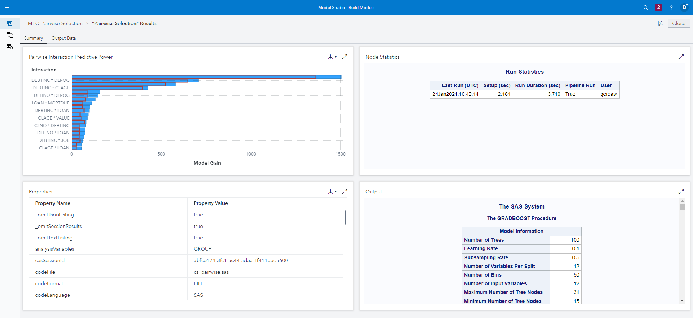

# Pairwise Selection in SAS Model Studio

If you want to learn more please refer to the [SAS Documentation](https://go.documentation.sas.com/doc/en/capcdc/default/vdmmlcdc/vdmmlref/n1q1iegd23xbbdn1stmu1ijg9ir6.htm)

1. Go to SAS Model Studio

2. Click _New project_

3. Give the project a name, e.g. _HMEQ Pairwise Selection_

4. As the type select _Data Mining and Machine Learning_

5. As the template select _Blank template_

6. For data select the HMEQ dataset that can be created with the [Load HMEQ Utility script](../utility/loadHMEQ.sas)

7. Click _Save_

8. In the _Data_ tab select the variable _BAD_ and change its role to _Target_

9. Go to the pipelines tab, right click the _Data_ node and select _Add child node > Data Mining Preprocessing > Pairwise Selection_

10. Click _Run pipeline_, wait for the pipeline to finish

11. Right click the _Pairwise Selection_ selection and select _Open_

You can view my example report [here](./Pairwise_Selection_Results.pdf)
