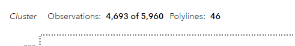
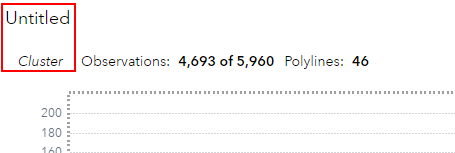

## Automatic Titles for Models Objects

Read the general release notes on this [here](https://go.documentation.sas.com/doc/en/vacdc/v_023/vswn/p12t8xl1pyg5ron1dyks6ys601wn.htm).

Here is how it looked like if you added, for example a *Cluster* object to your report

Now if you went ahead and added a *Custom/Automatic Title* it looked like this - not this represented *Custom Title* with *Automatic Title* instead of *Untitled* it would read *Cluster*:

The new default starting with SAS Viya 2024.01 and on is that the model is always automatically added as a object title and the model is removed from the *Observations: n of m Polylines: y* line - which, in my opinion, makes the whole thing look a lot cleaner:

