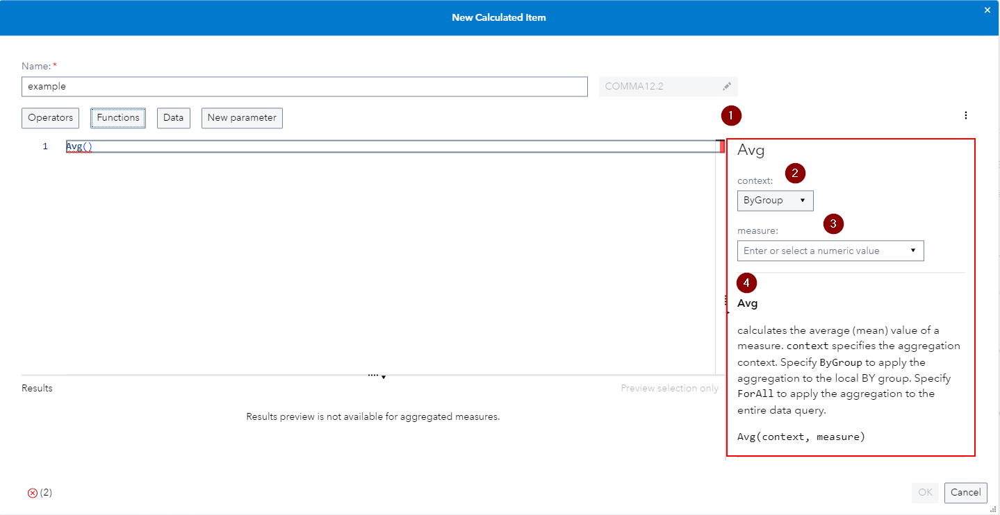
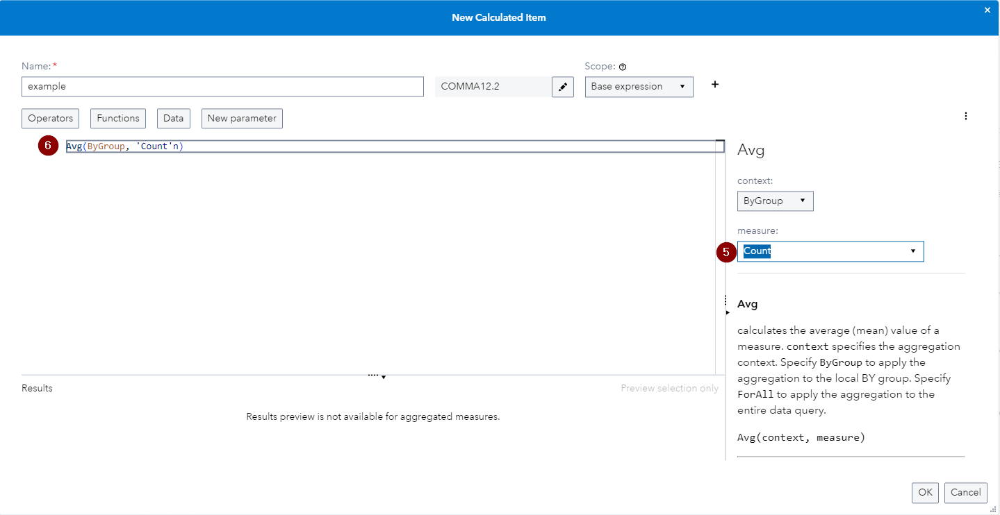
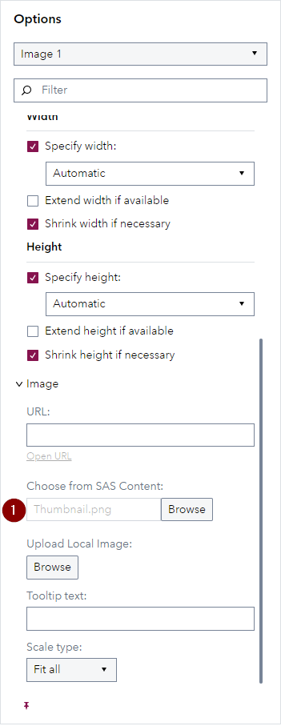
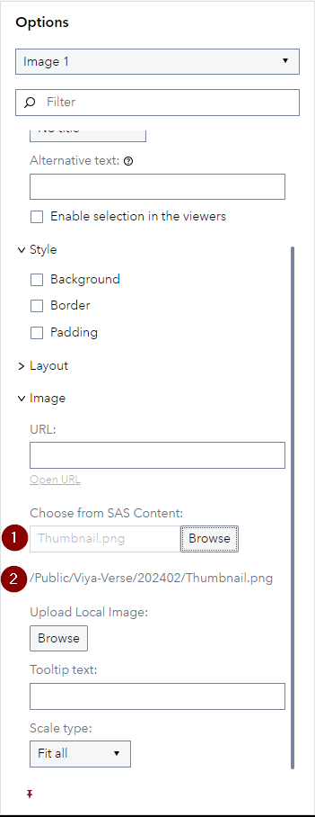

# SAS Visual Analytics Enhancements in SAS Viya 2024.02

This small visual demonstration is built off of the SAS Visual Analytics What's New section for SAS Viya 2024.02 - find the source information [here](https://go.documentation.sas.com/doc/en/vacdc/v_023/vawn/n06dk85whhji1sn16w80vuqlkhti.htm).

## Enhancement to the Expression Editor for Calculated Items & Advanced Filters

If you open the Expression Editor for a new or existing Calculated Item and for Advanced Filters you will see that on the right-hand-side (**1**) you have a new section which provides you the ability to visually specify the properties of selected functions or operators (**2, 3**) and you can find more details about them here as well (**4**).

This next screenshot showcases how you can use the UI to specify the properties (**5**), in this case of the Avg function, and see the updated code in the main editor window (**6**):

## Enhancement for the Image Object

For image objects, the Options pane displays the path for images that are stored in SAS Content. Under the section *Image* you could already see what image is called (**1**), but now you see the full path in SAS Content displayed (**2**):

| Image Object Pane Pre 2024.02                                | Image Object Pane From 2024.02                               |
| ------------------------------------------------------------ | ------------------------------------------------------------ |
|  |  |

