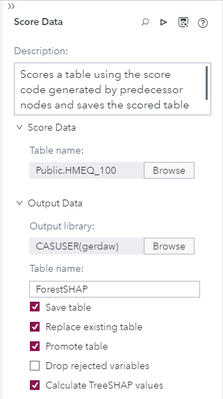
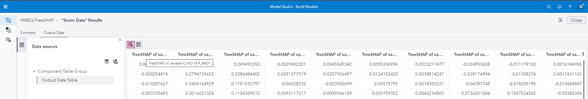

# Calculate TreeSHAP in SAS Model Studio

New property Calculate TreeSHAP values under Output Data enables you to specify whether to calculate TreeSHAP values for Forest or Gradient Boosting models for all observations - If you want to learn more please refer to the [SAS Documentation](https://go.documentation.sas.com/doc/en/capcdc/default/vdmmlcdc/vdmmlref/p0b0yv4ymd2onzn1lyixfch9jmhd.htm#p011wagdabfn5an1g3p80gbh0249)

1. Go to SAS Model Studio

2. Click _New project_

3. Give the project a name, e.g. _HMEQ TreeSHAP_

4. As the type select _Data Mining and Machine Learning_

5. As the template select _Blank template_

6. For data select the HMEQ dataset that can be created with the [Load HMEQ Utility script](../utility/loadHMEQ.sas)

7. Click _Save_

8. In the _Data_ tab select the variable _BAD_ and change its role to _Target_

9. Go to the pipelines tab, right click the _Data_ node and select _Add child node > Supervised Learning > Forest & Gradient Boosting_

10. Then right click the *Forest* model node and select _Add child node > Miscellaneous > Score Data_

11. Next for the Node options add a table under the *Score Data* (you can use the full HMEQ, I created a smaller set with just 100 obserations) the add an *Output library* and add a *Table name*, e.g. *CASUSER and ForestSHAP*. And finally select *Save table, Replace existing table, Promote table and Calculate TreeSHAP values*
    

12. Right click the *Score Data* select *Copy*, right click the *Gradient Boosting* node and select *Paste* and update the the *Output Data Table name*, e.g. GBSHAP - you can also use **CTRL+C** and **CTRL+V**

13. Click _Run pipeline_, wait for the pipeline to finish

14. Right click the _Score Data_ node and select _Results_

15. Switch to the *Output Data* tab and click the *View output data* button and in the pop up select *View output data* - scrolling to the right you will find all of SHAP values:

