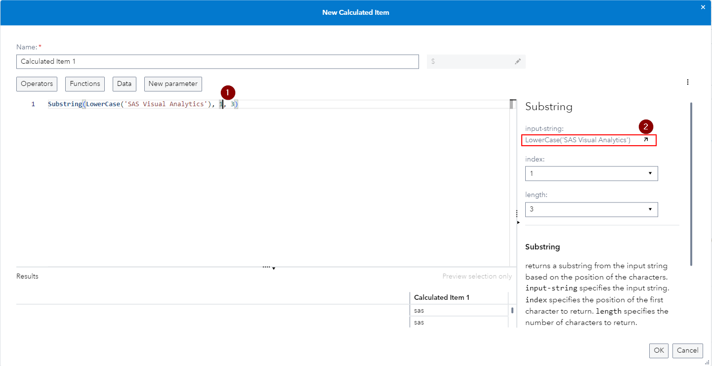

# SAS Visual Analytics Enhancements in SAS Viya 2024.03

This small visual demonstration is built off of the SAS Visual Analytics What's New section for SAS Viya 2024.03 - find the source information [here](https://go.documentation.sas.com/doc/en/vacdc/v_024/vawn/n0ybnzspaizt9wn1fewdoibc2byp.htm).

## Enhancement to the Expression Editor for Calculated Items & Advanced Filters

If you open the Expression Editor for a new or existing Calculated Item and for Advanced Filters and enter a nested expression e.g. *Substring(LowerCase('SAS Visual Analytics'), 1, 3)* and then click into the outer expression **(1)**, you can then use the visual editor on the right to use the pop out icon **(2)** to be taken to the nested expression **(3, 4)** to edit that one more easily:

