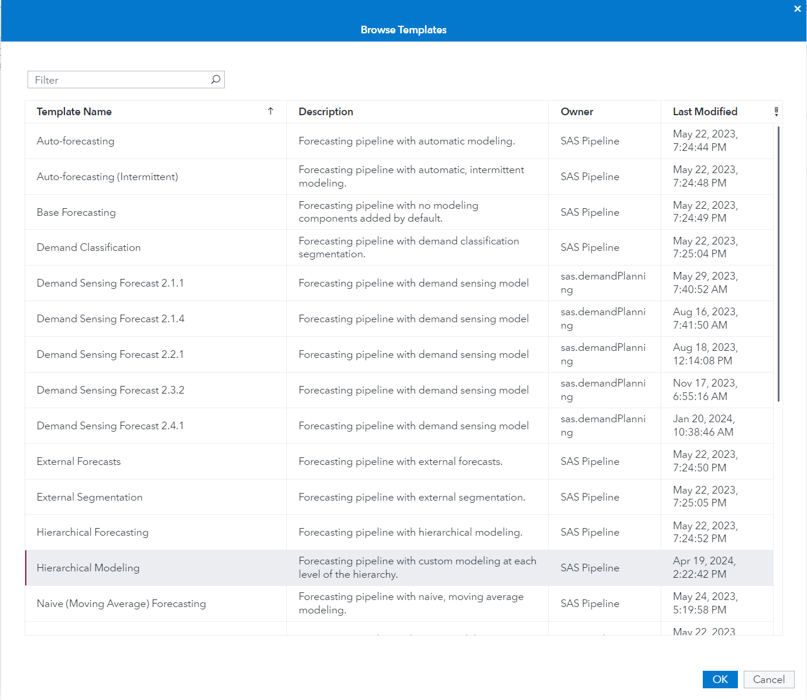

# Add Hierarchical Modeling Pipeline Template

If you want to learn more please refer to the [SAS Documentation](https://go.documentation.sas.com/doc/en/capcdc/v_026/vfcdc/vfwn/n0fx7k6k7qmny7n1dvnk23ibv8dm.htm)

1. Go to SAS Model Studio

2. Click _New project_

3. Give the project a name, e.g. _BTC Unbiasedness Test_

4. As the type select _Forecasting_

5. As the template select Hierarchical Modeling_

6. For data select the BTC dataset that can be created with the [BTC utility script](../utility/getBitcoinPrice.sas)

7. Click _Save_

8. Go to _Pipelines_ and let the _Pipeline 1_ run

