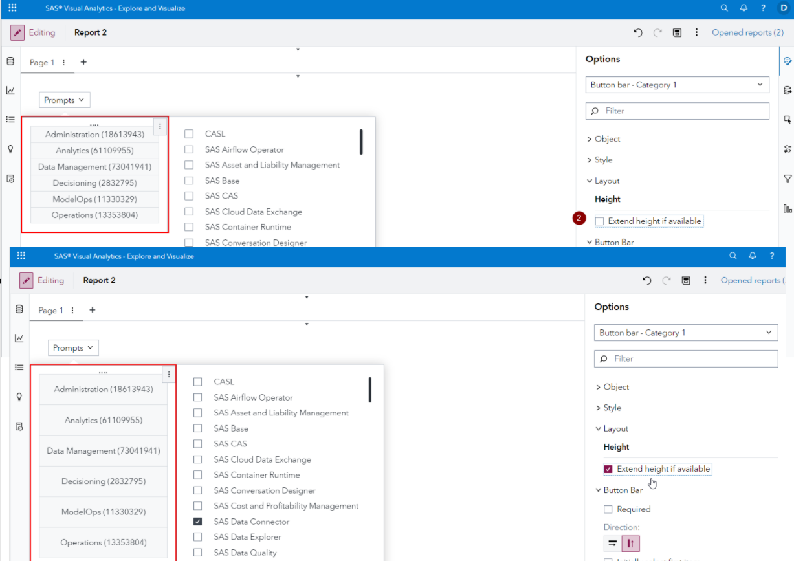
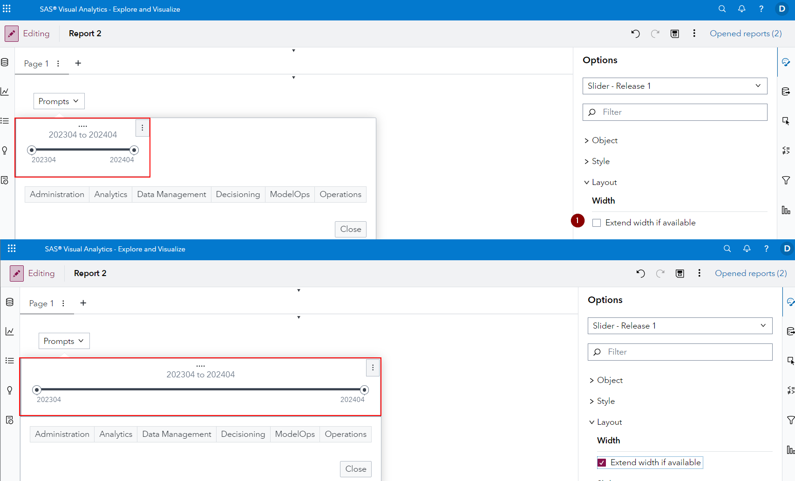

# SAS Visual Analytics Enhancements in SAS Viya 2024.04

This small visual demonstration is built off of the SAS Visual Analytics What's New section for SAS Viya 2024.04 - find the source information [here](https://go.documentation.sas.com/doc/en/vacdc/v_025/vawn/p03mpx69ypow4tn1rxfh3mim1hjt.htm).

## Enhancement to the Prompt Container object

If you add a Prompt Container object to your report and the go to add mulitple control objects to it, you can now make use of the *Extend height if available* (available for vertical prompt containers) and *Extend width if available* (available for horizontal prompt containers) option to customize the look and feel:

First up is the horizontal prompt container

And next is the vertical prompt container
