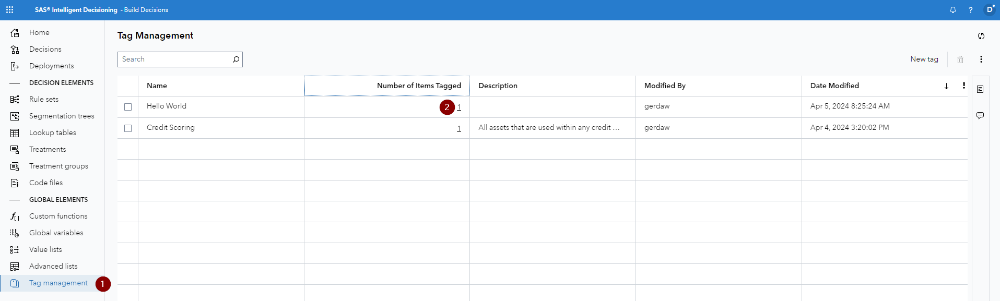
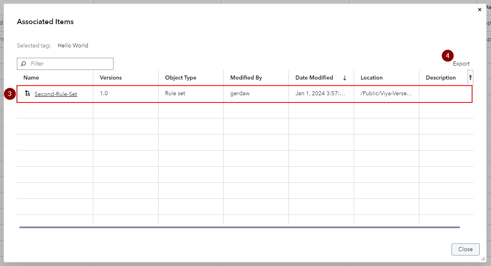

# Enhancement to the Tag Management in SAS Intelligent Decisioning

The Associated Items window for a tag now includes additional information about each object that is associated with the selected tag - to find out more check out the [SAS documentation](https://go.documentation.sas.com/doc/en/edmcdc/v_046/edmug/p1bwk9m5c9h104n102a4sah3iasl.htm).

Now let's see this in action:

1.   Navigate to the *Tag management* page in SAS Intelligent Decisioning
2.   Click on the *Number of Items Tagged* cell for the tag that you are interested in

3.   Each row displays the information about one decisioning asset that has been tagged
4.   You can use the *Export* button to download a PDF report of the dialog you are currently viewing