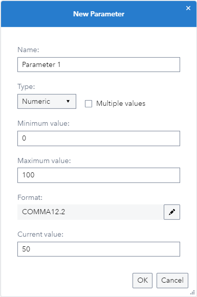
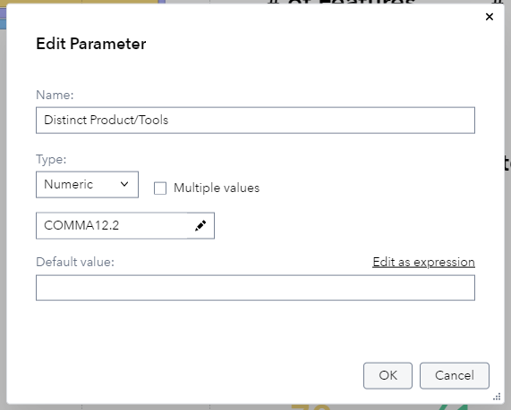
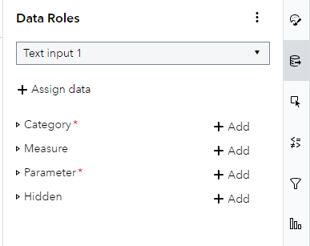
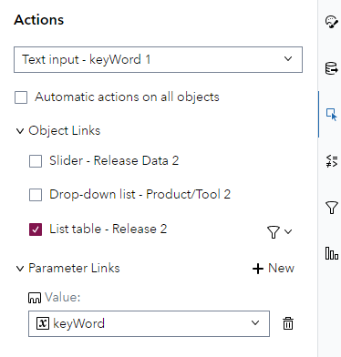
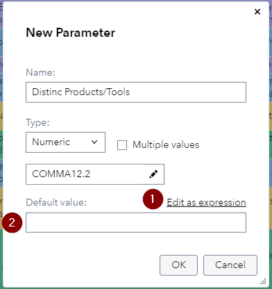
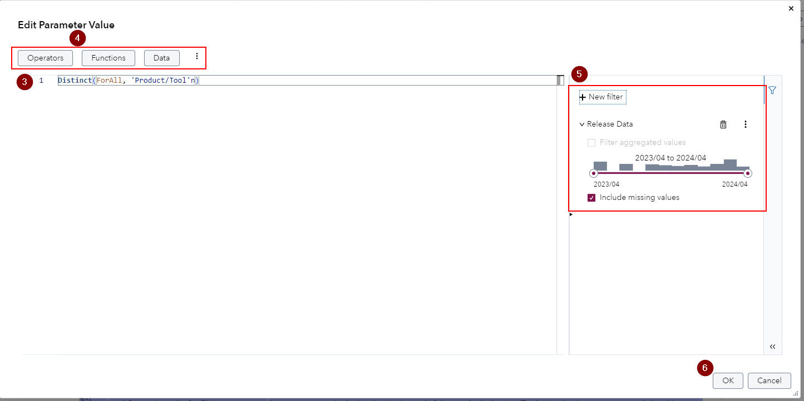
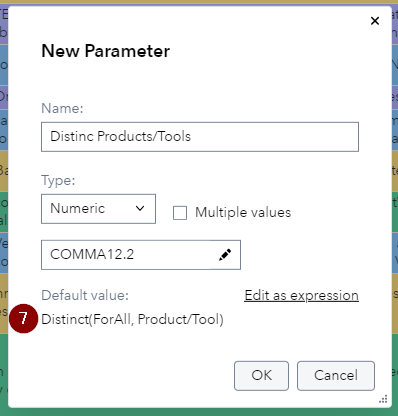
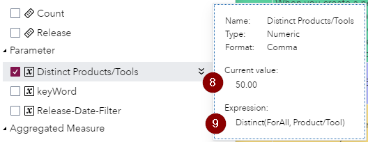
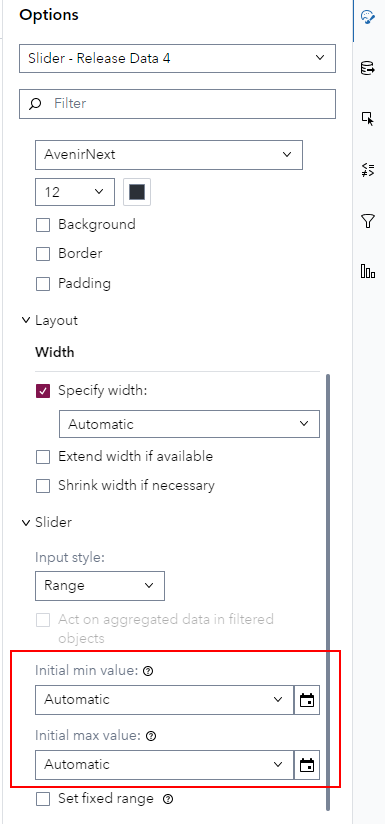

# SAS Visual Analytics Enhancements in SAS Viya 2024.05

This small visual demonstration is built off of the SAS Visual Analytics What's New section for SAS Viya 2024.05 - find the source information [here](https://go.documentation.sas.com/doc/en/vacdc/v_026/vawn/p0er3ews3zq3oan1p19txuy3umhl.htm).

## Enhancement Report Parameters

The parameters have received three new enhancements, let us look at them from least significant to most significant.

### **Optional Minimum & Maximum**

With numeric and data parameters you previously had to specify the minimum and maximum values for the parameters:

| Old Parameter Dialog                                         | New Parameter Dialog                                         |
| ------------------------------------------------------------ | ------------------------------------------------------------ |
|  |  |

### **Parameter assignment has moved from the Roles pane to the Actions pane**

Previously parameters where assigned as part of the roles of an object from the *Controls* category (Button bar, Drop-down list, List, Slider and Text input), this was now moved into the actions pane instead:

| Old Parameter Assignment                                     | New Parameter Assignment                                     |
| ------------------------------------------------------------ | ------------------------------------------------------------ |
|  |  |

If you have used a parameter in a previous release the migration happens automatically for you, once the report is opened.

### **Ability to specify Expressions to set the value of a parameter**

In previous version you could only use parameters as value stores that would hold a data value. Now with this new enhancement you can write an expression to calculate values or extract things from a value. Of course parameters can still be used in calculations, filters, display rules and so on. Parameter values are not affected by object filters, ranks, drilling into a hierarchy and so - this makes them powerful for creating benchmarking/reporting KPIs. Let's take a look at how it looks like:

1.   Click here to open up the expression editor where you can visually build the expression
2.   If you do not want to create an expression, but just want to set a *Default value* you can still do this here

3.   Here you can edit the expression directly, getting auto-completion and syntax help
4.   Or you can use these buttons to add to expression in a visual way
5.   Of course you can add filters to your parameter, even advanced filters
6.   Clicking OK will save the expression

7.   Now instead of an input field for the *Default value* we can see the expression created in the editor

8.   Hovering over the parameter in the *Data* pane will show its current value
9.   And also display the expression

## Initial Value Option for Control Objects

Control objects (Button bar, Drop-down list, List and Text input) have a new *Initial value* option. The Single value slider has the option of setting an initial minimum or initial maximum values and the Range slider can have a initial minimum and initial maximum value. These values are used when a user opens the report for the first time, or when they select to restore the default report state:

