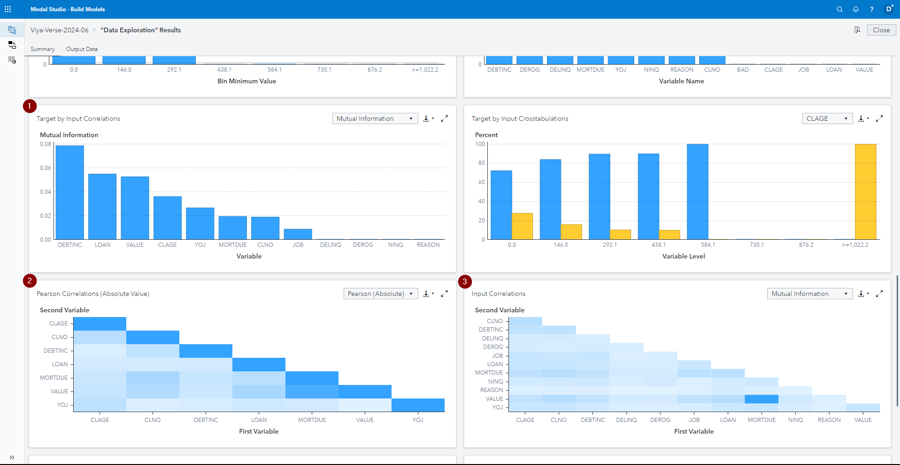
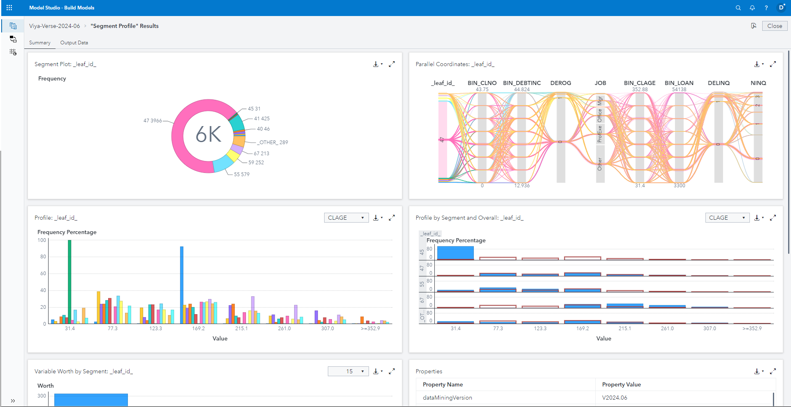
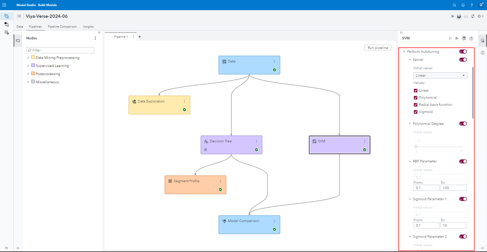

# Setup in SAS Model Studio

The setup setup is provided to follow the examples provided below - if you already have a project setup you can skip this chapter

1. Go to SAS Model Studio

2. Click _New project_

3. Give the project a name, e.g. _HMEQ New in 2024 06_

4. As the type select _Data Mining and Machine Learning_

5. As the template select _Blank template_

6. For data select the HMEQ dataset that can be created with the [Load HMEQ Utility script](../utility/loadHMEQ.sas)

7. Click _Save_

8. In the _Data_ tab select the variable _BAD_ and change its role to _Target_

# Enhanced Data Exploration Results

The *Data Exploration* results now also includes the following new outputs: **Input Correlations, Pearson Correlations (Absolute Value) and Target by Input Correlations** - to learn more check the [SAS Documentation](https://go.documentation.sas.com/doc/en/capcdc/default/vdmmlcdc/vdmmlref/n0l1o83pmcvxzmn19o2w243n843a.htm)

1. Go to the pipelines tab, right click the _Data_ node and select _Add child node > Miscellaneous > Data Exploration_

2. Click _Run pipeline_, wait for the pipeline to finish

3. Right click the _Data Exploration_ selection and select _Results_

You can view my example report [here](./Data_Exploration_Results.pdf)

# Segment Profile after a Decision Tree

Previously you could only add a *Segment Profile* node after a *Clustering* node, now you can also add it after a *Decision Tree* node - to learn more about the *Segment Profile* node, check out the [SAS Documentation](https://go.documentation.sas.com/doc/en/capcdc/default/vdmmlcdc/vdmmlref/p08hron5tpdwa1n1gza5mehf2zew.htm)

1. Go to the pipelines tab, right click the _Data_ node and select _Add child node > Supervised Learning > Decision Tree_

2. Right click the *Decision Tree* and select *Add child node > Miscellaneous > Segment Profile*

3. Click _Run pipeline_, wait for the pipeline to finish

4. Right click the _Segment Profile_ selection and select _Results_

You can view my example report [here](./Segment_Profile_Results.pdf)

# Enhancements to the SVM autotuning

Additional parameters have been added to the autotuning for SVM, this includes the ability to specify a **Kernel, RBF and Sigmoid Parameter** - for a complete list of parameters check out the [SAS Documentation](https://go.documentation.sas.com/doc/en/capcdc/default/vdmmlcdc/vdmmlref/n032dyilswgnz9n18ckyefwnhynk.htm#p1a3ppoa28acp3n1uuqp6gccugjy)

1.   Go to the pipelines tab, right click the _Data_ node and select _Add child node > Supervised Learning > SVM_
2.   Left click on the *SVM* node and on the right hand-side in the *Node options* pane toggle *Perform Autotuning*

