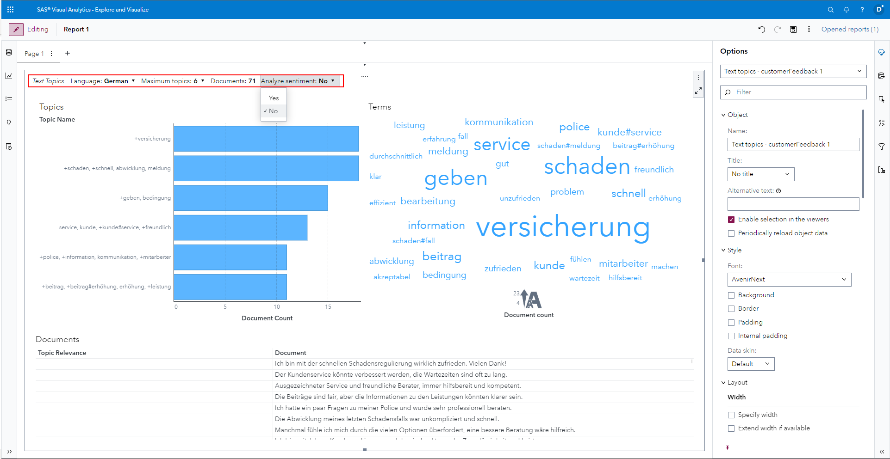

# SAS Visual Analytics Enhancements in SAS Viya 2024.06

This small visual demonstration is built off of the SAS Visual Analytics What's New section for SAS Viya 2024.06 - find the source information [here](https://go.documentation.sas.com/doc/en/vacdc/default/vawn/p1nh8qp8u0tw77n0zk0nm6v1vpdm.htm#n0nf039c32u8qqn1eey6i5mpro1u).

## Enhancement to the Path Analysis object

If you have data edit rights for the report and have the report open in viewing mode, you can now create and edit path filters, more in the [SAS Documentation](https://go.documentation.sas.com/doc/en/vacdc/default/vawn/p1nh8qp8u0tw77n0zk0nm6v1vpdm.htm#p17402vsbjysjun12yixt2j2y22b).

You can set the data edit right using the report level options and customize the *Viewer Capabilities* to *Data edits*, more on this in the [SAS Documentation](https://go.documentation.sas.com/doc/en/vacdc/default/vareports/p05fpeqrecaml3n1smn0k3gelqzk.htm#n16v6t0r171dyzn1la3mx0vapjbp).

## Enhancement to the Text Topic object

The *Text Topic* object has received two major updates, that you can also find in the [SAS Documentation](https://go.documentation.sas.com/doc/en/vacdc/default/vawn/p1nh8qp8u0tw77n0zk0nm6v1vpdm.htm#n0nf039c32u8qqn1eey6i5mpro1u).

### New Heading

When you add a *Text Topic* object to the page and run it you know get a heading that contains the *Model type, Document Language, Maximum number topics, Documents analyzed and if the Sentiment analysis was run*. If you are in the edit mode of the report you even have quick access from this heading to change the *Language*, update the number of *Maximum topics* or change if you want the *Sentiment analysis* or not.

### Layout Customization

You now have additional options to change how the *Text Topic* object looks like in the report. There are two subheadings, so lets talk about them quickly:

#### General

First you have the *Displayed visuals* category where you can select which of the following elements are shown in the report: *Header, Topics, Terms & Documents*.

Next you can change the *Plot layout*, where the default is *Fit*, which adds all select elements on one page, the additional value is *Stack*, which creates a tab for each of the selected elements *Topics, Terms & Documents*.

And finally you can select how or if numeric values are abbreviated.

#### Header

Here you can change which of the five fields are displayed in the *Header* element, if it is shown: *Model type, Language, Maximum topics, Documents & Analyze sentiment*.

Here is an example where I customized some of the Options:

