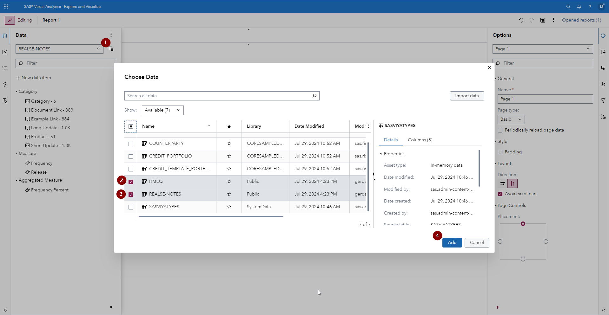
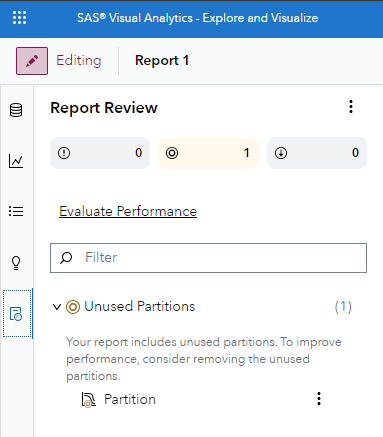

# SAS Visual Analytics Enhancements in SAS Viya 2024.07

This small visual demonstration is built off of the SAS Visual Analytics What's New section for SAS Viya 2024.07 - find the source information [here](https://go.documentation.sas.com/doc/en/vacdc/default/vawn/n17r0ffs9bj12kn185k73hzgvbn8.htm).

## Add Multiple Data Sources at One Time

You can now add multiple data sources to a report at one time in the Choose Data window, which you can open from either the Data pane or the Suggestions pane.

## Updated Report Review Pane

The Report Review pane now displays a warning if your report contains a partition that is not used by any objects.

