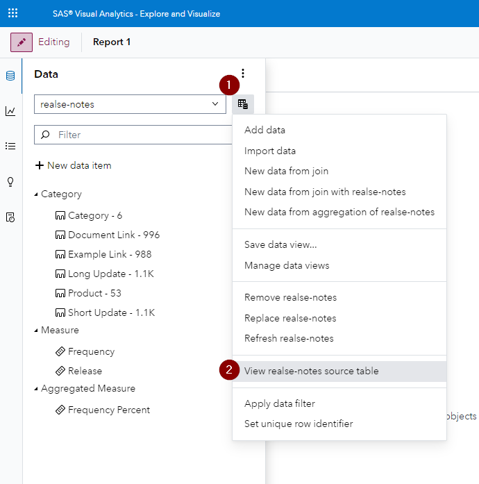
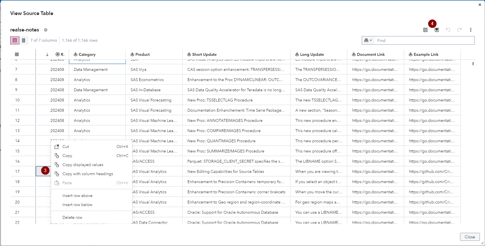
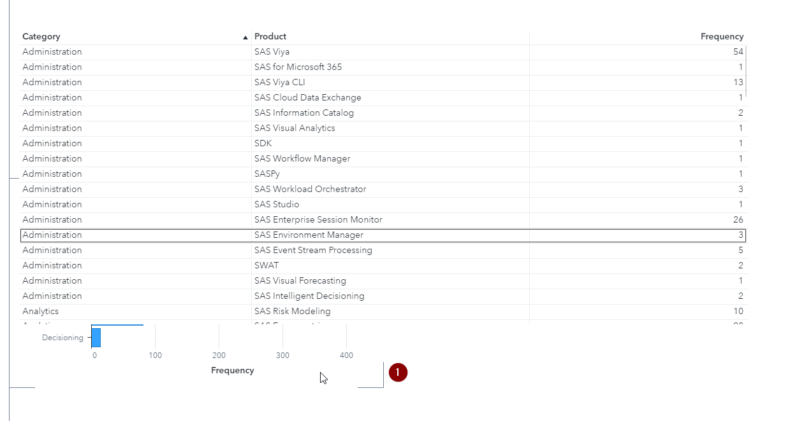
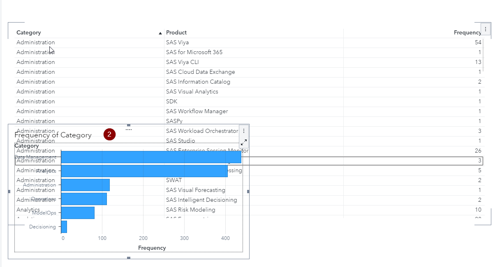
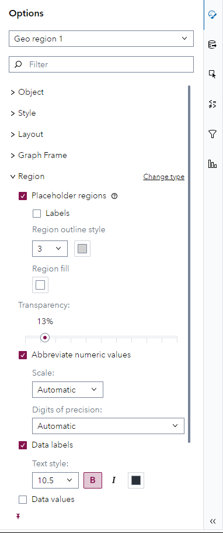

# SAS Visual Analytics Enhancements in SAS Viya 2024.08

This small visual demonstration is built off of the SAS Visual Analytics What's New section for SAS Viya 2024.08 - find the source information [here](https://go.documentation.sas.com/doc/en/vacdc/v_027/vawn/n0hxu5mikeiy5rn1xkdzksb7fo8i.htm).

## New Editing Capabilities for Source Tables

When you are viewing the source table for a data source, you can now edit the table. You can perform actions such as applying filters, adding and deleting columns, editing individual data values, and adding and deleting rows. You can save your changes if you have Write permissions for the location.

1. & 2. enable you two get into the View Source Table where you can edit the table

3. Right clicking a row you can copy, cut, insert and delete or by left clicking into a cell you can edit

4. Clicking the save icon enables you to save the table

More details on this can be found in the [SAS documentaiton](https://go.documentation.sas.com/doc/en/vacdc/v_027/vareportdata/n0hk5nlzlwj7don19ziq4946pwdn.htm#p14ocrbg8jvjzon18j8tv6wfl48h).

## Enhanced Precision Containers

These enhancements are made when you are editing a report.

When you move the cursor over an object that is not selected, corner brackets appear. The corner brackets indicate the borders of the object.

If you select an object that is in the background, then it is temporarily moved to the front so that all of its contents are visible and available to interact with.

## Enhanced Geo Region and Geo Region-Coordinate Map

For geo region maps and geo region-coordinate maps, a new option enables you to display placeholder regions for regions that are not represented in the data. Placeholder regions can provide additional context for your map.

