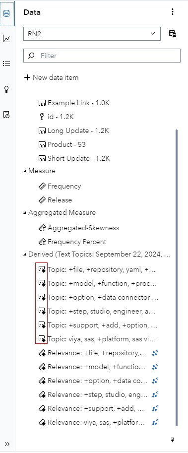

# SAS Visual Analytics Enhancements in SAS Viya 2024.09

This small visual demonstration is built off of the SAS Visual Analytics What's New section for SAS Viya 2024.09 - find the source information [here](https://go.documentation.sas.com/doc/en/vacdc/v_028/vawn/n1tk86zu2bnpccn15ay2vb1wnrky.htm).

## Text Topic only Documents

In text topics objects, only documents that are part of a topic are displayed. Hiding the documents that are not part of the analysis makes text topics more consistent with the other analytical objects in SAS Visual Analytics.

## Moved Data Tip Options

The Data tip style and Data tip background options are now under the Style heading in the Options pane. Previously, these options were under the Graph Frame heading.

## New Aggregated Measures Icon

There is a new icon for aggregated measures:

# SAS Visual Statistics Enhancements in SAS Viya 2024.09

This small visual demonstration is built off of the SAS Visual Statistics What's New section for SAS Viya 2024.09 - find the source information [here](https://go.documentation.sas.com/doc/en/vacdc/v_028/vswn/n0rhnoqhw32k1yn1taw6h3fwqko1.htm).

## Deprecated Option for Decision Trees Is Removed

The deprecated Rapid growth option is now removed from any existing reports when you promote them to this release. As there is no visual change in the UI there is no screenshot here.

## New Derived Measures Icon

There is a new icon for derived measures:

## New Derived Categories Icon

There is a new icon for derived categories:

